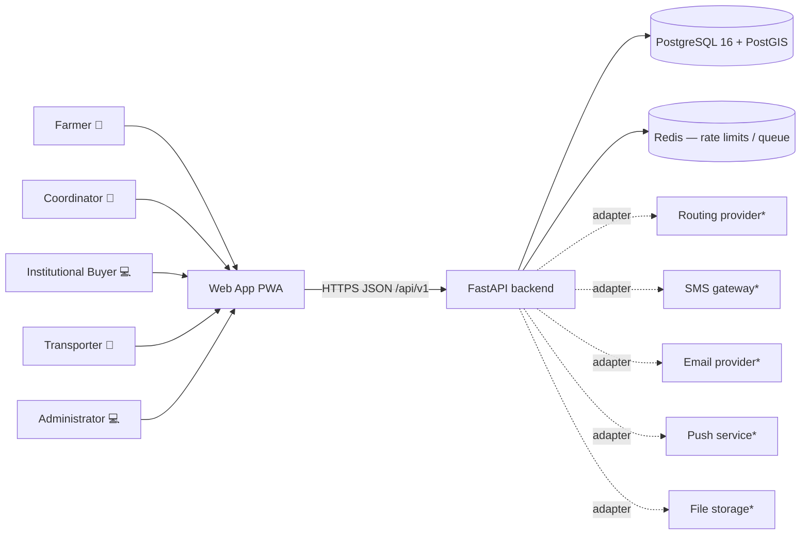
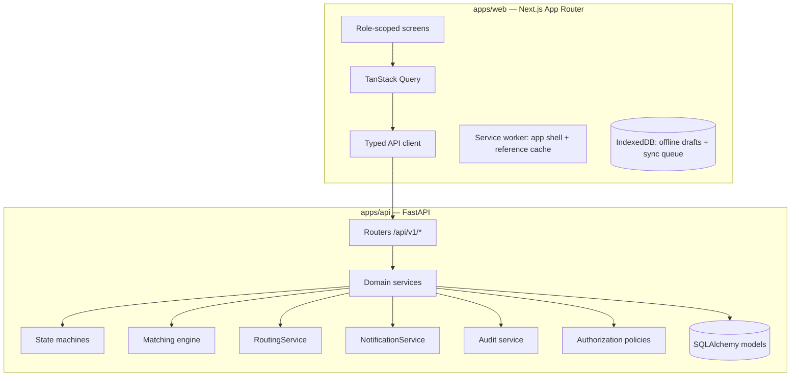
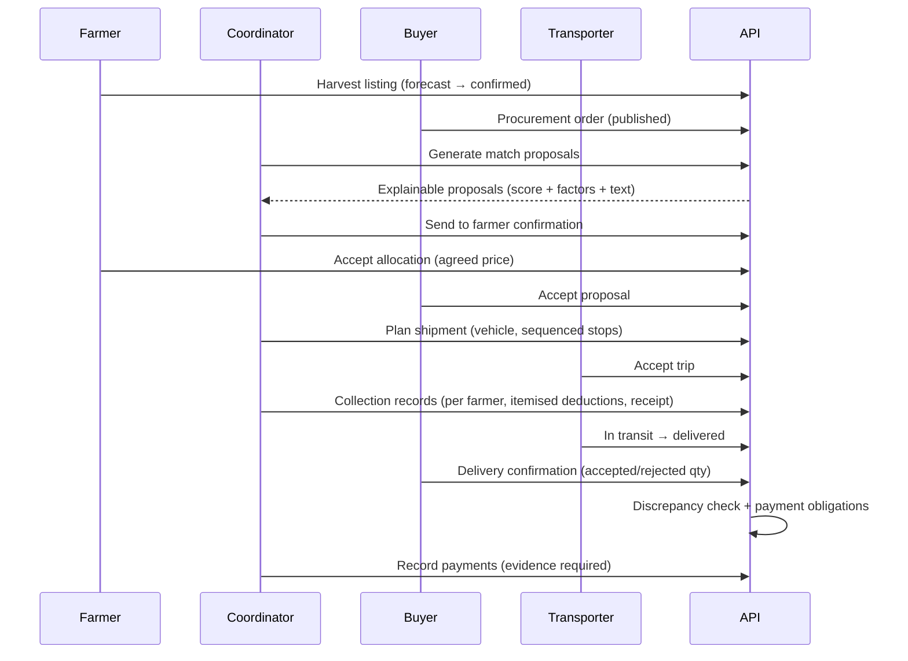
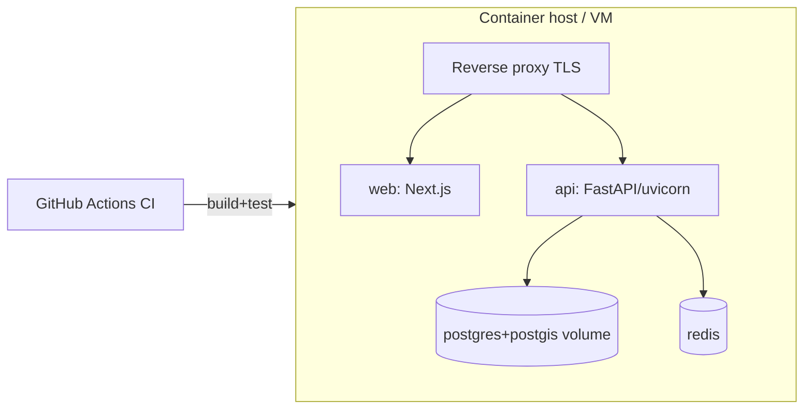

# DrukAgriLink — Architecture

## 1. System context



`*` = behind an adapter interface with a working local/mock implementation in the MVP.

## 2. Components



## 3. Data flow — the core transaction



## 4. Authentication

- Registration with role selection; passwords hashed with `pbkdf2_sha256` (600k iters).
- Login issues a short-lived JWT **access token** (30 min) and a **refresh token**
  (opaque, 14 days). Refresh tokens are stored hashed, are single-use, and rotate on
  every refresh; reuse of a rotated token revokes the whole family (theft detection).
- Login attempt throttling (per-account + per-IP) via the rate limiter.
- `last_login_at` tracked; suspended (`is_active=false`) accounts are rejected at the
  dependency layer.

## 5. Authorization model

Two layers, both server-side and centralised in `app/core/policies.py`:

1. **Role-based** — route dependencies (`require_roles(...)`) gate endpoint groups.
2. **Object-level** — policy functions receive `(actor, resource)` and enforce
   ownership/assignment: farmers see only their own listings/receipts/payments;
   coordinators only their assigned groups; buyers only their organization's orders;
   transporters only their provider's trips. Cross-account access returns 404 (existence
   is not leaked) or 403 where existence is public.

Verification is a separate axis: unverified farmers/buyers may draft but not publish.

## 6. Notification architecture

`NotificationService.notify(user, template_key, context)` renders a template in the
user's preferred language and fans out to enabled channels through
`NotificationChannel` adapters: `InAppChannel` (DB row, always on), `MockEmailChannel`,
`MockSmsChannel`, `MockPushChannel` (record deliveries for inspection). Essential
transaction/security templates cannot be disabled by preference.

## 7. Offline synchronisation

- Service worker caches the app shell and reference data (products, grades, locations).
- Harvest-listing and collection drafts are written to IndexedDB with the last-seen
  server `row_version`.
- The sync queue replays drafts on reconnect. The API's write endpoints accept an
  `expected_row_version`; a mismatch returns `409 CONFLICT_STALE_VERSION` with the
  current server state, and the client shows a side-by-side conflict screen
  (local vs server, timestamps, changed fields, keep-mine / take-server / merge).
- Nothing is silently overwritten; tokens are kept in memory + httpOnly-style storage
  patterns, never in the draft store.

## 8. Matching engine

Pure, deterministic pipeline (`app/services/matching.py`):

```
candidates = hard_constraints(order_item)      # product/variety/grade/date/price/verified/available
groups     = group_by_collection_area(candidates)
allocation = allocate(groups, required_qty)    # greedy by price then proximity, capped by availability
score      = weighted_factors(allocation)      # quantity/date/price/quality/transport/spoilage, 0–100 each
explanation= render_explanations(score, allocation)   # plain-language sentences
```

Every proposal stores `score`, per-factor breakdown, and the explanation sentences.
No proposal is auto-finalised: coordinator → farmer(s) → buyer must each approve, and
transport feasibility is confirmed before collection.

## 9. Routing abstraction

```python
class RoutingService(Protocol):
    def estimate_route(self, stops: list[RoutePoint]) -> RouteEstimate: ...
```

- `MockRouter` — fixed values for tests.
- `LocalApproxRouter` — haversine distance × configurable mountain-road factor
  (default 1.6) × average speed; every estimate carries
  `method="approximate_local"` and the UI labels it "approximate".
- `ExternalRouterAdapter` — documented integration point (OSRM/Valhalla/Google);
  requires credentials, not available in the MVP environment.

Stop sequencing uses a deterministic nearest-neighbour heuristic with a documented
OR-Tools upgrade path behind the same interface; coordinators can manually reorder
stops (manual override always wins).

## 10. Deployment view



GitHub Pages hosts only the pre-existing Jekyll site in this repository; DrukAgriLink
deploys via Docker Compose to a container host (see `DEPLOYMENT.md`).

## 11. Major decisions

| Decision | Why |
| --- | --- |
| Monorepo under `druk-agrilink/` | Preserve the unrelated Jekyll site and its CI |
| Server-side business rules only | Clients can be offline/stale; money and state must be authoritative |
| SQLite for tests, Postgres for runtime | Fast CI; migration validation still runs against real Postgres+PostGIS in CI |
| Deterministic matching, no ML | Explainability and pilot trust; AI extension points are interfaces only |
| Optimistic concurrency (`row_version`) | Cheap, explicit conflict detection for offline sync |
| 404 over 403 for cross-tenant reads | Don't leak resource existence across accounts |
