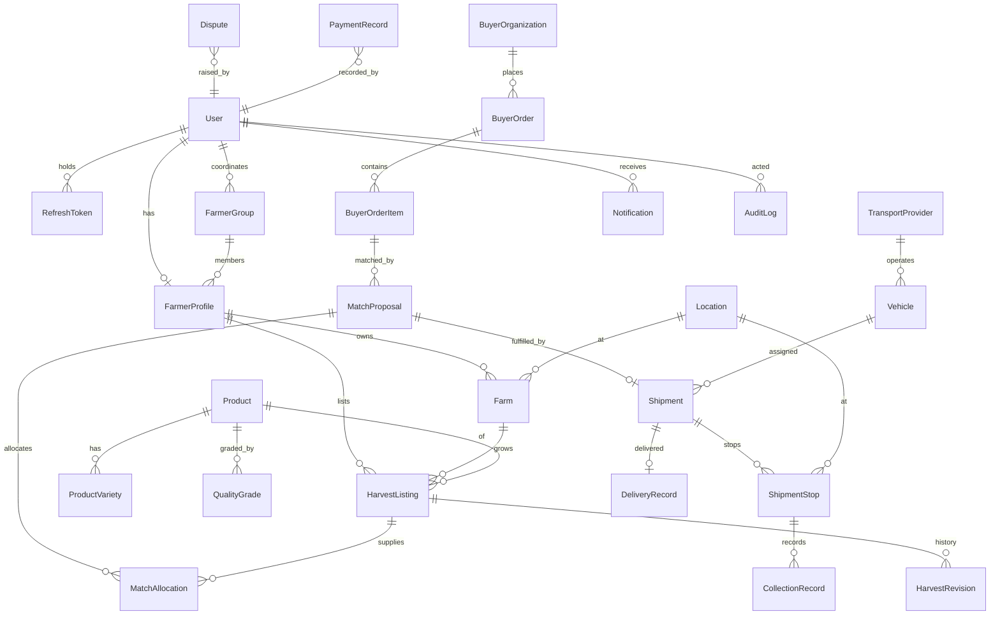

# DrukAgriLink — Data Model

All entities use UUID primary keys, `created_at`/`updated_at` timestamps (UTC), and
explicit status enums. Money uses `Numeric` (Decimal) — never binary floats. Soft
deletion is via `is_active`/terminal statuses; rows carrying financial history are never
hard-deleted.

## 1. Entity relationships



## 2. Entities (summary — authoritative definitions in `apps/api/app/models/`)

- **User** — email, phone, password_hash, role (`farmer|coordinator|buyer|transporter|admin`),
  preferred_language (`en|dz`), is_active, is_verified, last_login_at.
- **FarmerProfile** — user_id, display_name, farmer_registration_reference,
  farmer_group_id, primary_phone, preferred_contact_method, verification_status, notes.
- **Farm** — farmer_id, farm_name, dzongkhag, gewog, village, latitude, longitude,
  road_access_notes, is_active.
- **FarmerGroup** — name, registration_reference, dzongkhag, gewog,
  coordinator_user_id, verification_status, default_collection_point_id.
- **Location** — name, location_type (`collection_point|delivery_point|farm|depot|other`),
  country, dzongkhag, gewog, village, address, landmark, latitude, longitude,
  road_access_notes.
- **Product / ProductVariety / QualityGrade** — catalogue with local_name, category,
  default_unit, storage_category, shelf_life_days; grades ordered by sort_order.
- **HarvestListing** — forecast/confirmed/available quantities, unit, harvest window,
  minimum_unit_price, expected_grade, packaging, confidence, status, `row_version`
  (optimistic concurrency for offline sync). Revisions in **HarvestRevision**
  (field, old→new, actor, timestamp).
- **BuyerOrganization** — organization_type (hotel/school/hospital/…),
  verification_status, contacts, payment_terms_days.
- **BuyerOrder / BuyerOrderItem** — delivery location + date, item-level product,
  variety, minimum grade, offered/max unit price, packaging, accepted_quantity.
- **MatchProposal** — proposed_quantity, estimated_transport_cost, delivery time,
  spoilage risk, matching_method, score, `score_factors` (JSON), `score_explanation`
  (JSON list of sentences), status.
- **MatchAllocation** — proposal × listing, allocated_quantity, agreed_unit_price,
  farmer_response (`pending|accepted|declined`), farmer_response_at.
- **TransportProvider / Vehicle** — service_dzongkhags (JSON), capacity_kg,
  refrigeration, supported categories, verification_status, is_available.
- **Shipment / ShipmentStop** — planned/actual pickup+delivery times,
  planned_distance_km, estimated/actual transport cost, status, incident_notes;
  stops carry stop_type (`pickup|delivery`), sequence_number, planned/collected qty.
- **CollectionRecord** — expected/presented/accepted/rejected quantities, grade,
  unit_price, gross_amount, transport_deduction, platform_fee, other_deduction,
  net_amount_due, rejection_reason, farmer+coordinator confirmations, photo_urls,
  receipt_number (`DAL-YYYY-NNNNNN`).
- **DeliveryRecord** — delivered/accepted/rejected quantities, arrival_condition,
  rejection_reason, buyer+transporter confirmations, proof URLs, discrepancy_flag.
- **PaymentRecord** — payer/recipient (type+id), related order/collection, amount,
  due_date, status, payment_method, payment_reference, paid_at, recorded_by.
- **Notification** — user, channel, template_key, subject, body, status, timestamps.
- **Dispute** — raised_by, related entity (type+id), category, description, status,
  assigned_to, resolution, resolved_at.
- **AuditLog** — actor, action, entity type+id, before/after state (sanitised),
  reason, ip, user_agent. Never contains passwords, tokens, or unnecessary PII.

## 3. Status values & state machines

Defined once in `app/domain/enums.py` and enforced by
`app/services/state_machine.py`; invalid transitions raise
`409 INVALID_STATE_TRANSITION` with the attempted and allowed transitions.

- **HarvestListing**: `draft → forecast → confirmed → partially_allocated →
  fully_allocated → collected`; terminals `cancelled`, `expired`.
- **BuyerOrder**: `draft → published → matching → proposed → confirmed →
  collection_in_progress → in_transit → delivered → accepted → payment_pending →
  completed`; alternates `cancelled`, `expired`, `partially_fulfilled`, `disputed`.
- **MatchProposal**: `generated → coordinator_review → farmer_confirmation →
  buyer_confirmation → approved`; alternates `rejected`, `expired`, `superseded`.
- **Shipment**: `planning → offered → assigned → confirmed →
  collection_in_progress → in_transit → arrived → delivered → completed`;
  alternates `delayed`, `cancelled`, `incident_reported`.
- **PaymentRecord**: `pending | partially_paid | paid | overdue | disputed |
  waived | cancelled`.

## 4. Financial calculations

All arithmetic in `Decimal`, quantised to 2 dp (`ROUND_HALF_UP`):

```
gross_amount      = accepted_quantity × unit_price
net_amount_due    = gross_amount − transport_deduction − platform_fee − other_deduction
```

Deductions are stored separately (never netted invisibly) and printed line-by-line on
the receipt. Delivery discrepancy: if buyer-accepted quantity differs from the sum of
collection-accepted quantities by more than the configured tolerance (default 2%), the
delivery is flagged and a dispute can be opened.

Payment obligations generated at delivery confirmation:

1. Buyer → cooperative: buyer-accepted qty × agreed prices.
2. Cooperative → each farmer: that farmer's `net_amount_due`.
3. Buyer (or cooperative, per configuration) → transporter: agreed transport cost.
4. Platform/coordination fee: recorded as its own line, never hidden.

## 5. Quantity accounting invariants

For each listing: `available = confirmed − Σ active allocations`; a proposal may not
allocate more than `available`; collection `accepted ≤ presented`;
`presented = accepted + rejected`. Enforced server-side with explicit error codes.

## 6. Audit & soft-deletion strategy

Sensitive actions (verification decisions, suspensions, payment recording, dispute
resolution, admin config changes, receipt generation) write an AuditLog row inside the
same transaction. Financially-relevant rows are never deleted; deactivation flips
`is_active` or moves to a terminal status. Audit rows are append-only.
